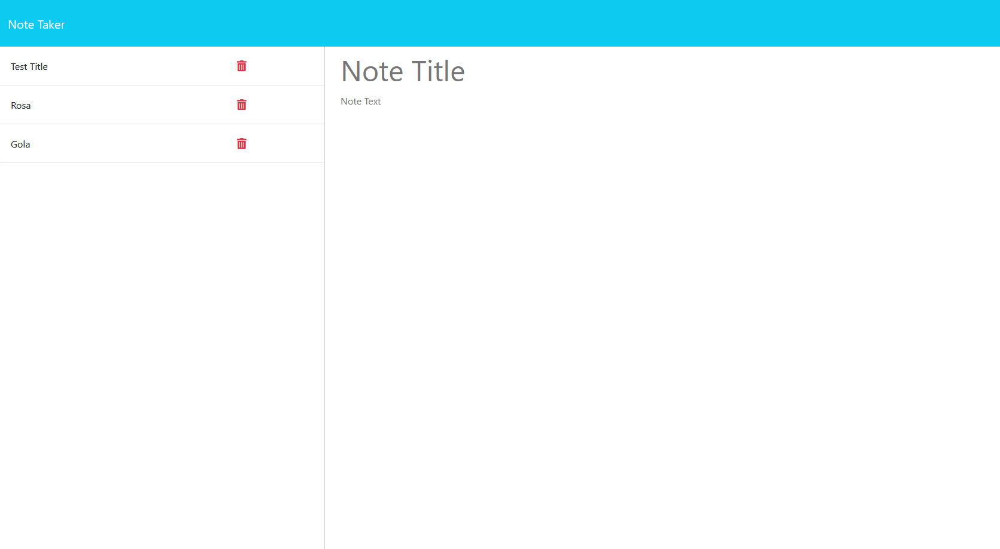

# Note Taker

## Description

The Note Taker application is a simple yet powerful tool designed to help individuals organize their thoughts and keep track of tasks. This web application allows users to write, save, and delete notes seamlessly, ensuring that important information is always at hand. The application is built using Express.js for the back end, with notes being stored and retrieved from a JSON file, providing a lightweight and efficient solution for note management.

## User Story

As a small business owner, I want to be able to write and save notes so that I can organize my thoughts and keep track of tasks I need to complete.

## Acceptance Criteria

- When I open the Note Taker, I am presented with a landing page that has a link to a notes page.
- When I click on the link to the notes page, I am presented with a page that lists existing notes in the left-hand column and provides empty fields to enter a new note title and text in the right-hand column.
- When I enter a new note title and text, a "Save Note" button and a "Clear Form" button appear in the navigation at the top of the page.
- When I click the "Save Note" button, the new note is saved, appears in the left-hand column with existing notes, and the buttons in the navigation disappear.
- When I click on an existing note in the list, that note appears in the right-hand column, and a "New Note" button appears in the navigation.
- When I click the "New Note" button, I am presented with empty fields to enter a new note title and text, and the button disappears.

## Features

- Write and save notes
- View saved notes
- Delete notes
- User-friendly interface

## Installation

1. **Clone the Repository**:
    ```bash
    git clone https://github.com/yourusername/notetaker.git
    cd notetaker
    ```
2. **Install Dependencies**:
    ```bash
    npm install
    ```
3. **Start the Server**:
    ```bash
    npm start
    ```
4. **Access the Application**:
    Open your web browser and navigate to `http://localhost:3000` to use the Note Taker application.

## Deployment

The application is deployed and accessible via the following URL:
- **Live URL**: [https://your-deployed-app-url.com](https://your-deployed-app-url.com)

The source code is available on GitHub:
- **GitHub Repository**: [https://github.com/yourusername/notetaker](https://github.com/yourusername/notetaker)

## Screenshots

### Landing Page


## License

This project is licensed under the MIT License.
